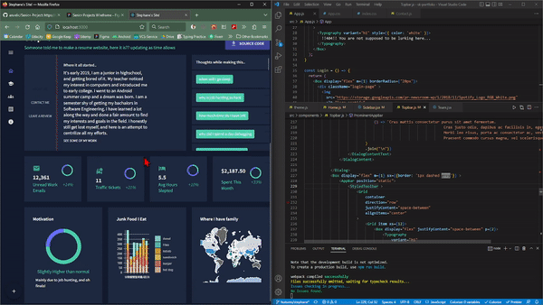
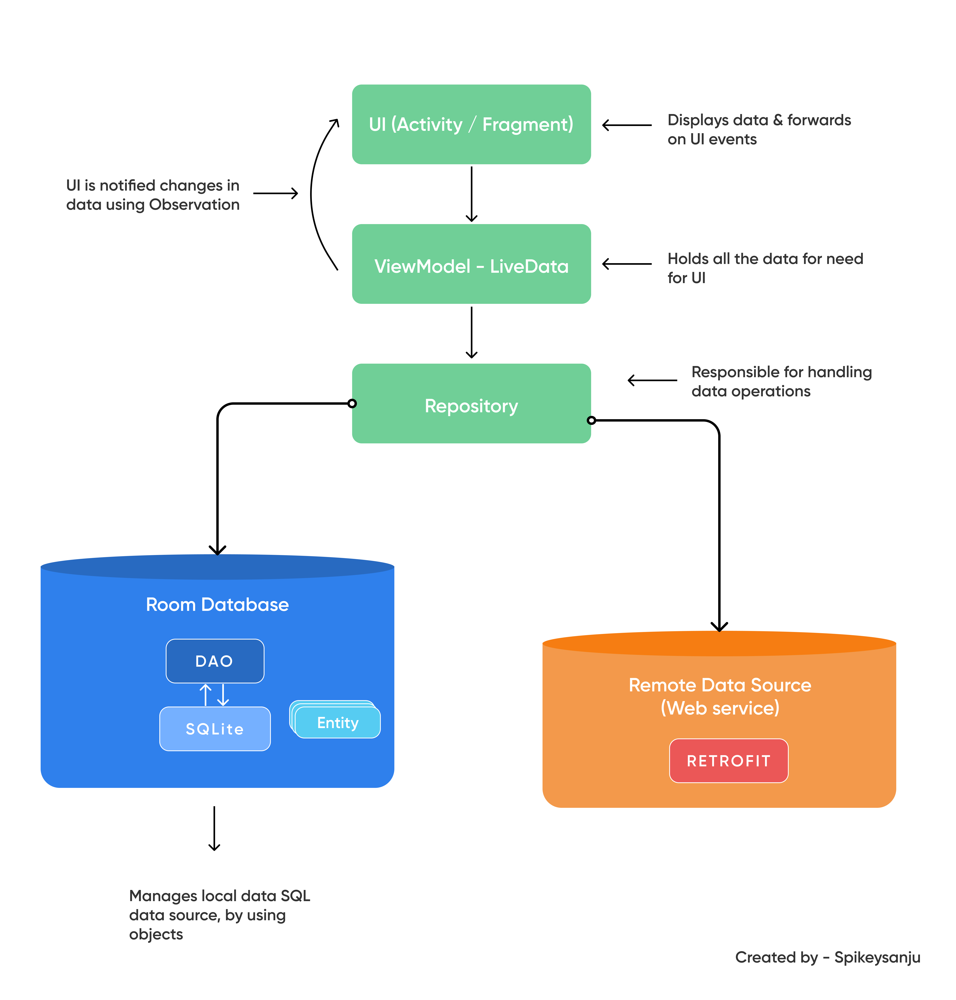

<h1 align="center" font-size="40px">
     sk-portfolio 🕸️
</h1>


**sk-portolio** is a web app made with react. It's indented to show my efforts online and a sort of one-stop-shop for anything regarding me that I think is worth while to put out there. It's meant to be a straight forward site with me essentially playing around with web tools and see what I can get running with the time and limited skills I got in the domain. 

## ➡️Timeline + Context 

I started this project and used it for one of my web dev class in my Fall 2022 semester. I have since been slowly and gruadually designing my idea for it and implementing it slowly as time goes. I plan to eventually make it live hosted right on my github. 

## ➡️Latest Demo

The main branch should usually be compiling and have a working version of the project. However, I have learned that is not always the case. Having a quick demo to show off can be helpful, and here's one:  



## ➡️Running the project

You will need to get a copy of the repo (either downloading it or cloning) and you will need Node.js and NPM. Once you have all of those then you can simply open the project in your editor of choice, and run it(with `npm start`)! 

## ➡️Design / Wireframes 

[Here](https://www.figma.com/file/DFiExxpwZE8WdXGxAnoHq6/SK-Porfolio?node-id=126%3A42&t=VBz1vkvS0q38JvBK-1) is the design of the project. 

## ➡️Architecture

A few thoughts were put together in the making of site, and a decent architecture pattern was followed. My main concerns were to keep code organized and a little easier for second set of eyes to follow and what not. I mainly followed footprint on common pratices out there and scoped it to my specific needs. These are from my mobile side of things but all trying to reach the same general goal of good code strucutre and seperation to keep it more stable as it scales. 



## ➡️Tools  🛠

This project makes use of quite a few third party libraries to work properly. If I am being honest this more than likely is not practical in most cases as you typically want to avoid any dependency unless really needed and stick to framework provided solutions. I wanted to play with web dev a little bit too with my semi-interactive web application and go through the process and eventually deploying it. Here are third party libraries that help shaped this:  

- [emotion/react](https://www.npmjs.com/package/@emotion/react) - to help with css styling. 

- 
## ➡️Copyright + Authors

### Authors 

[Stephane K](https://github.com/stephaneK123) (Dev and Design)

### License

As of right now, not too many concerns on copyright. I believe in true transparency, and crediting other's work that help shape yours as well. However, it's always good to cover yourself just incase and here is the typical copyright: 

```Permission is hereby granted, free of charge, to any person obtaining a copy of this software and associated documentation files (the "Software"), to deal in the Software without restriction, including without limitation the rights to use, copy, modify, merge, publish, distribute, sublicense, and/or sell copies of the Software, and to permit persons to whom the Software is furnished to do so, subject to the following conditions:``` 

```The above copyright notice and this permission notice shall be included in all copies or substantial portions of the Software.```

```THE SOFTWARE IS PROVIDED "AS IS", WITHOUT WARRANTY OF ANY KIND, EXPRESS OR IMPLIED, INCLUDING BUT NOT LIMITED TO THE WARRANTIES OF MERCHANTABILITY, FITNESS FOR A PARTICULAR PURPOSE AND NONINFRINGEMENT. IN NO EVENT SHALL THE AUTHORS OR COPYRIGHT HOLDERS BE LIABLE FOR ANY CLAIM, DAMAGES OR OTHER LIABILITY, WHETHER IN AN ACTION OF CONTRACT, TORT OR OTHERWISE, ARISING FROM, OUT OF OR IN CONNECTION WITH THE SOFTWARE OR THE USE OR OTHER DEALINGS IN THE SOFTWARE.```

Copyright (c) Feb 2023 Stephane Katende
